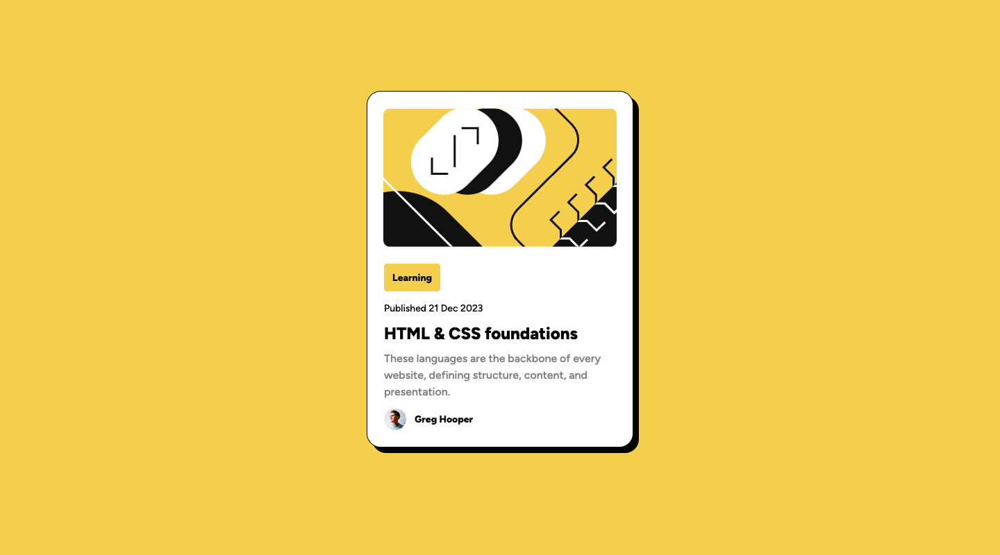

# Frontend Mentor - Blog preview card solution

This is a solution to the [Blog preview card challenge on Frontend Mentor](https://www.frontendmentor.io/challenges/blog-preview-card-ckPaj01IcS). Frontend Mentor challenges help you improve your coding skills by building realistic projects.

## Table of contents

- [Overview](#overview)
  - [The challenge](#the-challenge)
  - [Screenshot](#screenshot)
  - [Links](#links)
- [My process](#my-process)
  - [Built with](#built-with)
  - [What I learned](#what-i-learned)

## Overview

### The challenge

Users should be able to:

- See hover and focus states for all interactive elements on the page

### Screenshot



### Links

- Solution URL: [Github Repo](https://github.com/NuraSad/blog-preview-card-main)
- Live Site URL: [Demo](https://nurasad.github.io/blog-preview-card-main/)

## My process

### Built with

- Semantic HTML5 markup
- CSS custom properties
- Flexbox
- Mobile-first workflow

### What I learned

During working on this project I learn how to use fonts, that was downloaded on my local machine.

```
css
@font-face {
  font-family: "figtree";
  src: url("./assets/fonts/Figtree-VariableFont_wght.ttf");
}
```

## Author

- Frontend Mentor - [@NuraSad](https://www.frontendmentor.io/home)
